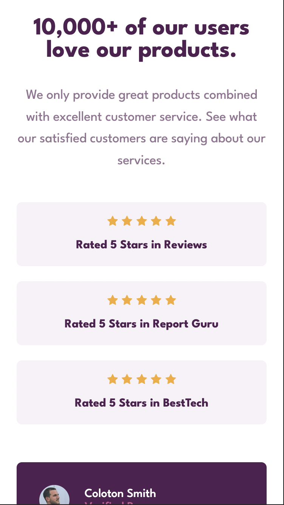
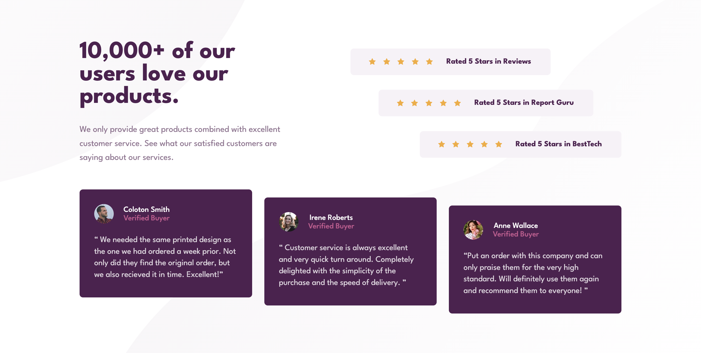

# Frontend Mentor - Social Proof Section

---

## Table of Content

* [Useful Links](#useful-links)
* [Mobile version](#mobile)
* [Desktop version](#desktop)

---

### Useful Links 

* [FM - Social Proof Section Component](https://www.frontendmentor.io/challenges/social-proof-section-6e0qTv_bA)

* [Vercel: My Solution](https://fm-10-social-proof-section.vercel.app/)

--- 
### Mobile version 

--- 
### Desktop version 

